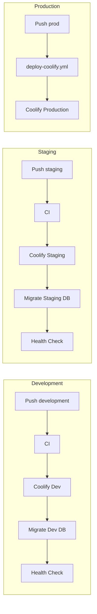

# CI/CD Guide

## Workflows (sarjan-textiles)

| Workflow                 | Trigger                              | Action                                  |
| ------------------------ | ------------------------------------ | --------------------------------------- |
| `ci.yml`                 | PRs to development/staging/prod/main | Lint, typecheck, build                  |
| `deploy-development.yml` | Push to `development`                | CI → Coolify dev → migrate → health     |
| `deploy-staging.yml`     | Push to `staging`                    | CI → Coolify staging → migrate → health |
| `deploy-coolify.yml`     | Push to **`prod`**                   | **Production** (unchanged)              |
| `ci-production-gate.yml` | PR to `prod`, manual                 | Extra audit + health                    |
| `apply-migrations.yml`   | Manual                               | Env-aware SQL migrations                |

## Required GitHub secrets

| Secret                           | Used by                           |
| -------------------------------- | --------------------------------- |
| `VPS_HOST`                       | All deploy workflows              |
| `VPS_USER`                       | All deploy workflows              |
| `VPS_SSH_PRIVATE_KEY`            | All deploy workflows              |
| `COOLIFY_API_TOKEN`              | All deploy workflows              |
| `COOLIFY_DEPLOY_WEBHOOK`         | Production (`deploy-coolify.yml`) |
| `COOLIFY_DEPLOY_WEBHOOK_DEV`     | Development                       |
| `COOLIFY_DEPLOY_WEBHOOK_STAGING` | Staging                           |

## GitHub Environments

Create in repo **Settings → Environments**:

- `development` — no approval
- `staging` — optional reviewer
- `production` — required reviewers (for migration workflow)

## Mobile apps

Build per environment:

```bash
# Consumer app
npm run build:apk:dev
npm run build:apk:staging
npm run build:apk          # production

# Admin app
npm run build:apk:dev
npm run build:apk:staging
npm run build:apk
```

`scripts/write-build-config.js` sets API URL before Gradle build.

## Pipeline diagram


