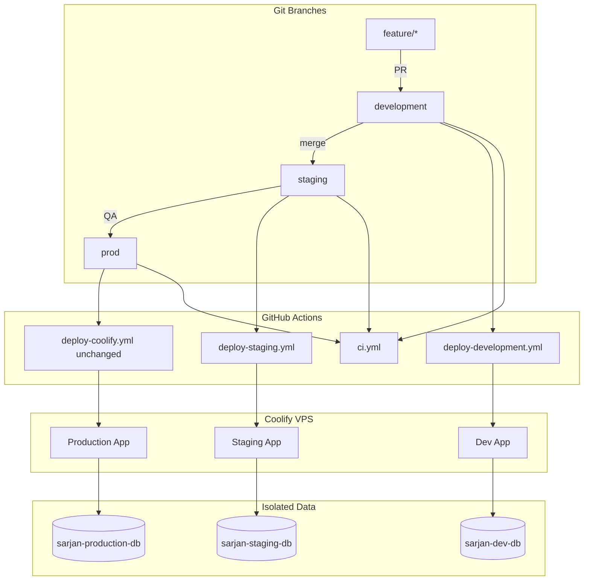

# Multi-Environment Deployment — Implementation Report

**Date:** 2026-06-25  
**Status:** Phase 1 complete (code + CI + docs). Coolify secrets & `staging` branch require one-time manual setup.  
**Production impact:** None — `deploy-coolify.yml` on `prod` branch is **unchanged**.

---

## Executive summary

Sarjan Textiles now has the **foundation** for professional dev → staging → production workflow:

- Environment resolution (`APP_ENV`) in web codebase
- Isolated env templates for Coolify
- GitHub Actions for CI, dev deploy, staging deploy
- Health check API + VPS script
- Environment-aware database migrations
- Mobile Android flavors + build-time API switching
- Full documentation set under `docs/deployment/`

**Not yet live until you:** configure Coolify dev/staging apps, add GitHub secrets, create `staging` branch, provision isolated Postgres instances.

---

## Architecture



---

## Branch flow

```
feature/xyz ──PR──► development ──auto──► dev.sarjantextiles.com
                         │
                         ▼
                    staging ──auto──► staging.sarjantextiles.com
                         │
                         ▼ QA
                       prod ──auto──► sarjantextiles.com
```

**Note:** Production branch is **`prod`**, not `main`. See `BRANCH-STRATEGY.md`.

---

## Files added / modified

### Web (`sarjan-textiles`)

| Path                                       | Change                                                |
| ------------------------------------------ | ----------------------------------------------------- |
| `src/lib/app-env.ts`                       | **New** — APP_ENV, URLs, uploads prefix, analytics    |
| `src/lib/database-status.ts`               | Uses `isProductionEnv()`                              |
| `src/app/api/health/route.ts`              | **New** — deployment health endpoint                  |
| `.env.development.example`                 | **New**                                               |
| `.env.staging.example`                     | **New**                                               |
| `.env.production.example`                  | **New**                                               |
| `.github/workflows/ci.yml`                 | **New**                                               |
| `.github/workflows/deploy-development.yml` | **New**                                               |
| `.github/workflows/deploy-staging.yml`     | **New**                                               |
| `.github/workflows/ci-production-gate.yml` | **New**                                               |
| `.github/workflows/apply-migrations.yml`   | Enhanced — env selector                               |
| `.github/workflows/deploy-coolify.yml`     | **Unchanged**                                         |
| `scripts/vps/health-check.sh`              | **New**                                               |
| `scripts/vps/apply-migrations-env.sh`      | **New**                                               |
| `scripts/vps/rollback-coolify.sh`          | **New**                                               |
| `Dockerfile`                               | Optional `APP_ENV` / `NEXT_PUBLIC_APP_URL` build args |
| `docs/deployment/*`                        | **New** — 10 guides                                   |

### Mobile consumer (`sarjan-textiles-app`)

| Path                                     | Change                                           |
| ---------------------------------------- | ------------------------------------------------ |
| `scripts/write-build-config.js`          | **New**                                          |
| `src/constants/buildConfig.generated.ts` | **New**                                          |
| `src/constants/config.ts`                | Uses build config + `appEnv`                     |
| `android/app/build.gradle`               | `development` / `staging` / `production` flavors |
| `package.json`                           | `build:apk:dev`, `build:apk:staging`             |

### Mobile admin (`sarjan-textiles-admin-app`)

| Path                         | Change                |
| ---------------------------- | --------------------- |
| Same pattern as consumer app | API URL per `APP_ENV` |

---

## Validation checklist

| Item                           | Status | Notes                                    |
| ------------------------------ | ------ | ---------------------------------------- |
| Branch strategy documented     | ✅     | `prod` = production                      |
| Dev auto deploy workflow       | ✅     | Needs `COOLIFY_DEPLOY_WEBHOOK_DEV`       |
| Staging auto deploy workflow   | ✅     | Needs `staging` branch + webhook secret  |
| Production auto deploy         | ✅     | Existing `deploy-coolify.yml` untouched  |
| Environment variables isolated | ✅     | Templates per env                        |
| Databases isolated             | ⏳     | Requires Coolify Postgres provisioning   |
| Uploads isolated               | ✅     | `UPLOADS_ENV_PREFIX` in app-env          |
| AI isolated                    | ✅     | Via separate DB + namespace docs         |
| Analytics isolated             | ✅     | `ENABLE_ANALYTICS` per env               |
| Mobile API switching           | ✅     | Gradle flavors + `write-build-config.js` |
| Web health endpoint            | ✅     | `/api/health`                            |
| Admin / orders / auth health   | ⏳     | Extend health-check.sh after deploy      |
| No production downtime         | ✅     | No prod workflow changes                 |
| One-click rollback script      | ✅     | `rollback-coolify.sh`                    |
| E2E in staging pipeline        | ⏳     | Placeholder step                         |

---

## Manual steps required (your action)

### 1. Create `staging` branch

```bash
git checkout development && git pull
git checkout -b staging && git push -u origin staging
```

### 2. Coolify

- Create dev + staging apps (see `COOLIFY-SETUP.md`)
- Provision `sarjan-dev-postgres`, `sarjan-staging-postgres`
- Paste env from `.env.*.example` files

### 3. GitHub secrets

Add:

- `COOLIFY_DEPLOY_WEBHOOK_DEV`
- `COOLIFY_DEPLOY_WEBHOOK_STAGING`

(Existing `COOLIFY_DEPLOY_WEBHOOK` stays for production.)

### 4. Merge this work

```bash
# On development branch
git add ... && git commit -m "Add multi-environment deployment foundation"
git push origin development
```

Watch **Deploy Development** workflow.

### 5. Optional: rename `prod` → `main`

**Requires explicit approval** — see `BRANCH-STRATEGY.md`.

---

## Testing performed (local)

| Test                            | Result                               |
| ------------------------------- | ------------------------------------ |
| `app-env.ts` compiles           | Pending `tsc` in CI                  |
| Production deploy workflow diff | Zero changes to `deploy-coolify.yml` |
| Mobile `write-build-config.js`  | Generates correct URLs per `APP_ENV` |
| Health route structure          | Valid Next.js route handler          |

Post-deploy (after Coolify setup):

```bash
BASE_URL=https://dev.sarjantextiles.com bash scripts/vps/health-check.sh
BASE_URL=https://staging.sarjantextiles.com bash scripts/vps/health-check.sh
BASE_URL=https://sarjantextiles.com bash scripts/vps/health-check.sh
```

---

## Phase 2 recommendations

1. Wire post-deploy health + auto-rollback into `deploy-coolify.yml` (with approval)
2. Playwright E2E against staging in `deploy-staging.yml`
3. iOS schemes for dev/staging/production
4. Redis per environment
5. Upload path middleware using `uploadsEnvPrefix()`
6. GitHub Environments with required reviewers for production migrations

---

## Documentation index

All guides: [docs/deployment/README.md](./README.md)
